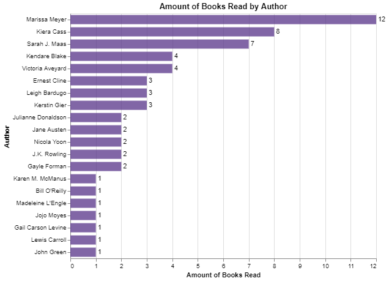
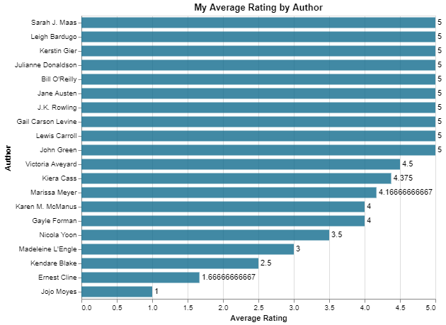
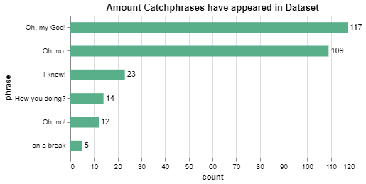
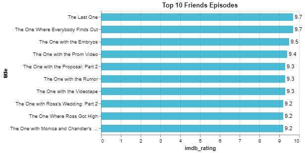

# DataAnalysis
Use Altair to analyze datasets. 

## Overview

{Important!  Do not say in this section that this is college assignment.  Talk about what you are trying to accomplish as a software engineer to further your learning.}

{Provide a description of the data set that you are analyzing.  Include the link of where you obtained the data.}

{Describe your purpose for writing this software to analyze the data.}

{Provide a link to your YouTube demonstration.  It should be a 4-5 minute demo of the data set, the questions and answers, the code running and a walkthrough of the code.}

[Software Demo Video](http://youtube.link.goes.here)

## Data Analysis Results

### Analysis of Books Dataset

### Which authors books have I read the most?

#### What are my top authors?

**My Top 3 Authors**
|    Author     |   books read   |
|:--------------|---------------:|
| Marissa Meyer |             12 |
| Kiera Cass    |              8 |
| Sarah J. Maas |              7 |

### What is my average rating of authors?

### Analysis of Friends Dataset

#### How many times does the friends characters catchphrase appear in the dataset?

#### What is the most popular Friends episode?

The most popular episode according to the frinds imdb dataset is 'The Last One.' The following chart of the top 10 episodes shows this.

## Development Environment

Using python packages pandas and altair I was able to analyze the datasets. The IDE used was VS Code.  

## Useful Websites

* [Different ways to create Pandas Dataframe](https://www.geeksforgeeks.org/different-ways-to-create-pandas-dataframe/)
* [Pandas Aggregate Documentation](https://pandas.pydata.org/docs/reference/api/pandas.DataFrame.aggregate.html)
* [Friends Quotes](https://www.washingtonpost.com/arts-entertainment/2019/09/22/friends-premiered-years-ago-here-are-beloved-sitcoms-most-memorable-quotes/)

## Datasets Used

#### Kaggle Datasets

* [Goodreads Books](https://www.kaggle.com/datasets/jealousleopard/goodreadsbooks)
* [Bestsellers books (Amazon, eBay, and Barnes&Noble)](https://www.kaggle.com/code/digenessilva/bestsellers-books-amazon-ebay-and-barnes-noble)
* [US Baby Names](https://www.kaggle.com/datasets/kaggle/us-baby-names)
* [Friends Script Data](https://www.kaggle.com/discussions/general/182990)
* [Friends Episode Data](https://www.kaggle.com/datasets/bcruise/friends-episode-data)

#### Other Datasets

* [My Goodreads](https://www.goodreads.com/review/list/84060474?ref=nav_mybooks)
* [Statista best selling books 2020](https://www-statista-com.byui.idm.oclc.org/statistics/324872/best-selling-mass-market-paperback-books-usa/)
* [Statista best selling books 2022](https://www-statista-com.byui.idm.oclc.org/statistics/324872/best-selling-mass-market-paperback-books-usa/)

## Future Work

* Use the name dataset to make charts of different names.
* Find what the most popular names are. 
* Have a dataset that contains all seasons of the Friends dialoge.
* Analyze how popular/books sold before and after Tic Tok.   
* Analyze book sales before and after thei movie released.
* Analyze book sales in relation to when certain resources became available, such as Amazon, Kindle/eBooks, Goodreads, and Tic Tok (Book Tok). 
* Incorporate names database with books. See if names became popular when they were in a book.