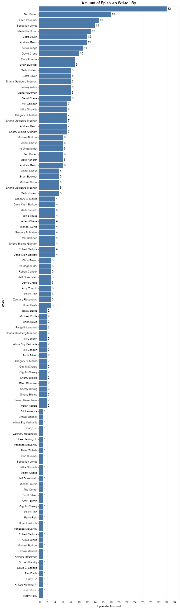

# DataAnalysis
Use Altair to analyze datasets. 

## Overview

This project analyzes my goodreads data, Friends dialogue, and Friends episode ratings. My goodreads data is a csv file of the books I have saved to various shelves. I obtained this data from [goodreads.com](https://www.kaggle.com/datasets/jealousleopard/goodreadsbooks) by exporting my data as a csv file. To get the Friends data, I used Kaggle. I used the datasets [Friends Script Data](https://www.kaggle.com/discussions/general/182990) and [Friends Episode Data](https://www.kaggle.com/datasets/bcruise/friends-episode-data).

The purpose for analyzing these datasets was to gain more experince with using Pandas and Altair. I used my goodreads data was to identify my favoite authors and my reading trends. I used Friends dataset to find the amount of times a characters catchphrase was used, the amount of episodes a writer wrote, and identifying the most popular episodes.  

[Software Demo Video](https://youtu.be/dGu4LQzZx80)

## Data Analysis Results

### Analysis of Books Dataset

### Which authors books have I read the most?

#### What are my top authors?

**My Top 3 Authors**
|    Author     |   books read   |
|:--------------|---------------:|
| Marissa Meyer |             12 |
| Kiera Cass    |              8 |
| Sarah J. Maas |              7 |

### What is my average rating of authors?

### Analysis of Friends Dataset

#### How many times does the friends characters catchphrase appear in the dataset?

#### What is the most popular Friends episode?

The most popular episode according to the frinds imdb dataset is 'The Last One.' The following chart of the top 10 episodes shows this.

#### How many episodes did each writer write?

## Development Environment

Using python packages pandas and altair I was able to analyze the datasets. The IDE used was VS Code.  

## Useful Websites

* [Different ways to create Pandas Dataframe](https://www.geeksforgeeks.org/different-ways-to-create-pandas-dataframe/)
* [Pandas Aggregate Documentation](https://pandas.pydata.org/docs/reference/api/pandas.DataFrame.aggregate.html)
* [Friends Quotes](https://www.washingtonpost.com/arts-entertainment/2019/09/22/friends-premiered-years-ago-here-are-beloved-sitcoms-most-memorable-quotes/)

## Datasets Used

#### Kaggle Datasets

* [Goodreads Books](https://www.kaggle.com/datasets/jealousleopard/goodreadsbooks)
* [Bestsellers books (Amazon, eBay, and Barnes&Noble)](https://www.kaggle.com/code/digenessilva/bestsellers-books-amazon-ebay-and-barnes-noble)
* [US Baby Names](https://www.kaggle.com/datasets/kaggle/us-baby-names)
* [Friends Script Data](https://www.kaggle.com/discussions/general/182990)
* [Friends Episode Data](https://www.kaggle.com/datasets/bcruise/friends-episode-data)

#### Other Datasets

* [My Goodreads](https://www.goodreads.com/review/list/84060474?ref=nav_mybooks)
* [Statista best selling books 2020](https://www-statista-com.byui.idm.oclc.org/statistics/324872/best-selling-mass-market-paperback-books-usa/)
* [Statista best selling books 2022](https://www-statista-com.byui.idm.oclc.org/statistics/324872/best-selling-mass-market-paperback-books-usa/)

## Future Work

* Use the name dataset to make charts of different names.
* Find what the most popular names are. 
* Have a dataset that contains all seasons of the Friends dialoge.
* Analyze how popular/books sold before and after Tic Tok.   
* Analyze book sales before and after thei movie released.
* Analyze book sales in relation to when certain resources became available, such as Amazon, Kindle/eBooks, Goodreads, and Tic Tok (Book Tok). 
* Incorporate names database with books. See if names became popular when they were in a book.
